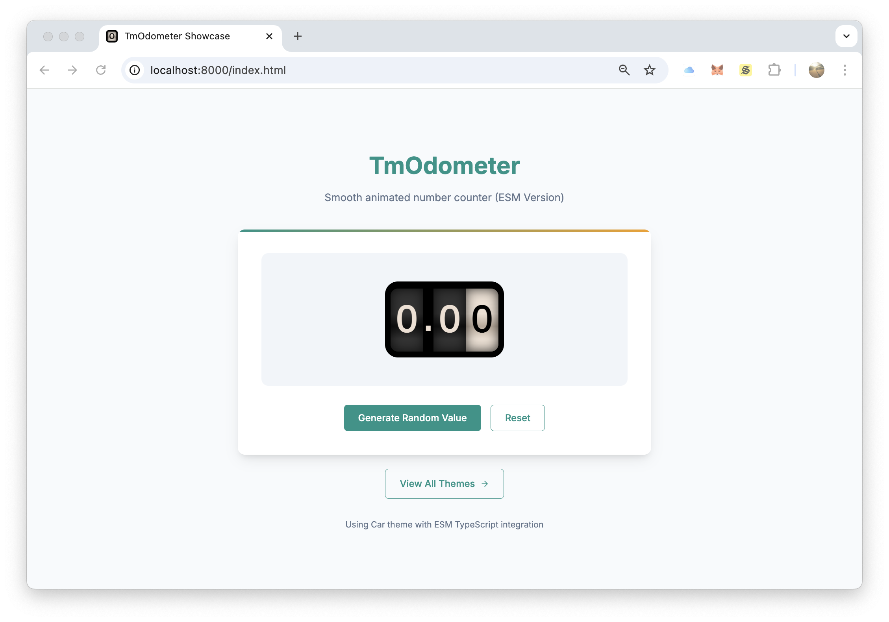

# TmOdometer [](https://www.npmjs.com/package/tm-odometer) [](http://opensource.org/licenses/MIT)

**TmOdometer** is a lightweight JavaScript library for creating animated numeric counters with smooth transitions and precise decimal handling. It is ideal for projects requiring dynamic number animations.

## Table of Contents

1. [Project Overview](#project-overview)
2. [Features](#features)
3. [Screenshots](#screenshots)
4. [Environment Setup](#environment-setup)
   - [Prerequisites](#prerequisites)
   - [Setup Steps](#setup-steps)
5. [Usage](#usage)
   - [How to Use](#how-to-use)
   - [Configuration](#configuration)
   - [Demos](#demos)
6. [Development](#development)
   - [Setup for Development](#setup-for-development)
7. [Acknowledgments](#acknowledgments)
8. [Extras](#extras)
   - [Angular Version](#angular-version)
9. [Support](#support)
10. [License](#license)

## Project Overview

**TmOdometer** is inspired by and built on top of **HubSpot's Odometer** library. It enhances the original functionality by introducing modern TypeScript and ES Module support, along with precise decimal handling to ensure numbers with decimal places retain their accuracy during and after animations (e.g., `1200` with a precision of 2 will display as `1200.00`). Designed for seamless integration into any JavaScript or TypeScript project, it works effortlessly with modern module systems and bundlers.

While **TmOdometer** is a fully standalone library, it is also used as the foundation for the Angular version, [TmNgOdometer](https://github.com/mtmarco87/tm-ng-odometer), which provides seamless integration with Angular applications.

## Features

- **Lightweight**: Minimal dependencies and optimized for performance.
- **TypeScript Support**: Fully rewritten in TypeScript, the library provides type safety, an enhanced developer experience, and automatically generated type definitions.
- **Flexible Integration**: Works natively with ES Modules, CommonJS, AMD, and UMD bundles.
- **Decimal Precision**: Preserves decimal precision during animations.
- **Customizable Themes**: Supports various themes and animation styles.
- **Dynamic Updates**: Easily update values programmatically to trigger animations.

## Screenshots

See the TmOdometer in action below:


> _A quick look at the TmOdometer in action._

---

### Full FPS Video

[](https://github.com/user-attachments/assets/6c528e74-6f37-4e59-abf2-696eaf2ef863)

[](https://github.com/user-attachments/assets/fe5b4853-9c62-4119-90f8-8615d551d6a6)

> _Click to watch the high-quality video with smooth animations and detailed UI/UX._

## Environment Setup

### Prerequisites

- [Node.js/NPM](https://nodejs.org/)

### Setup Steps

1. Install the library via npm:

   ```bash
   npm install tm-odometer --save
   ```

2. Include one or more themes

   ```html
   <link
     rel="stylesheet"
     href="node_modules/tm-odometer/themes/odometer-theme-default.css"
   />
   ```

> **Tip:** Replace `'default'` in the file path with any of the available themes: `'car'`, `'digital'`, `'minimal'`, `'plaza'`, `'slot-machine'`, `'train-station'`.

3. Import the library using one of the following methods:

- **ES Modules**:

  ```javascript
  import TmOdometer from 'tm-odometer';
  ```

> **Tip:** If using TypeScript, types are directly provided with the library bundle.

- **CommonJS**:

  ```javascript
  const TmOdometer = require('tm-odometer');
  ```

- **AMD**:

  ```javascript
  require.config({
    baseUrl: './src',
    paths: {
      'tm-odometer': 'node_modules/tm-odometer/umd/tm-odometer',
    },
  });
  define(['tm-odometer'], function (TmOdometer) {});
  ```

- **Direct Inclusion**

  ```html
  <script src="node_modules/tm-odometer/umd/tm-odometer.min.js"></script>
  ```

## Usage

### How to Use

#### Use the Library Programmatically

Once the library is imported, you can use it as follows:

```javascript
const odometer = new TmOdometer({
  el: document.getElementById('odometer-element'),
  value: 1000,
  animation: 'count',
  duration: 2000,
  format: '(,ddd).dd',
  theme: 'default',
});

// Update the value programmatically
odometer.update(2000);
```

> **Tip:** When included directly, the legacy `Odometer` constructor is also available for backward compatibility with older versions.

#### Add Odometer to an Element

Another way to use the library is to add the `odometer` class to any element in your HTML:

```html
<div class="odometer">123</div>
```

Update the value programmatically:

```javascript
document.querySelector('.odometer').innerHTML = 456;

// or

document.querySelector('.odometer').odometer.update(456);
```

### Configuration

The library supports the following configuration options:

| **Option**  | **Type**      | **Default**   | **Description**                                                                                                                  |
| ----------- | ------------- | ------------- | -------------------------------------------------------------------------------------------------------------------------------- |
| `el`        | `HTMLElement` | `null`        | The DOM element where the odometer will be rendered.                                                                             |
| `value`     | `number`      | `0`           | The initial value of the odometer.                                                                                               |
| `animation` | `string`      | `'slide'`     | Animation effect type. Options: `'slide'`, `'count'`.                                                                            |
| `duration`  | `number`      | `2000` (ms)   | Duration of the animation in milliseconds.                                                                                       |
| `format`    | `string`      | `'(,ddd).dd'` | Number format. Examples: `'(,ddd)'` → `12,345`, `'(,ddd).dd'` → `12,345.67`, `(.ddd),dd` → `12.345,67`.                          |
| `theme`     | `string`      | `'default'`   | Theme for the odometer. Options: `'default'`, `'car'`, `'digital'`, `'minimal'`, `'plaza'`, `'slot-machine'`, `'train-station'`. |

#### Global Configuration

You can configure all odometer instances globally by defining the `window.odometerOptions` object **before** including or importing the `tm-odometer` library:

```html
<script>
  window.odometerOptions = {
    animation: 'count', // Animation type ('slide' or 'count')
    duration: 3000, // Animation duration in milliseconds
    format: '(,ddd).dd', // Number format
    theme: 'car', // Theme for all instances
  };
</script>
<script src="tm-odometer/umd/tm-odometer.min.js"></script>
```

### Per-Instance Configuration

If you need to configure a single odometer instance differently from the global configuration, you can initialize it programmatically using the `TmOdometer` constructor:

```html
<div id="custom-odometer"></div>

<script>
  const customOdometer = new TmOdometer({
    el: document.getElementById('custom-odometer'),
    value: 123,
    animation: 'count', // Animation type ('slide' or 'count')
    duration: 3000, // Animation duration in milliseconds
    format: '(,ddd).dd', // Number format
    theme: 'minimal', // Theme for this instance
  });

  // Update the value programmatically
  setTimeout(() => {
    customOdometer.update(4567.89);
  }, 1000);
</script>
```

### Demos

To help you get started, **TmOdometer** includes a comprehensive set of demos showcasing its usage with different module formats (CJS, ESM, UMD, AMD, and legacy). Each demo is a self-contained project that you can run locally.

#### Available Demos

| **Demo**        | **Description**                                                               |
| --------------- | ----------------------------------------------------------------------------- |
| **ESM**         | Demonstrates usage with native ES Modules in modern browsers.                 |
| **CJS**         | Demonstrates usage with CommonJS in Node.js or bundlers like Webpack/ESBuild. |
| **UMD Browser** | Demonstrates usage with UMD bundles directly in the browser via `<script>`.   |
| **UMD AMD**     | Demonstrates usage with AMD modules in environments like RequireJS.           |
| **Legacy**      | Demonstrates usage with the legacy version for older browsers.                |

#### How to Run the Demos

1. **Clone the Repository**:

   ```bash
   git clone https://github.com/mtmarco87/tm-odometer.git
   cd tm-odometer/demo
   ```

2. **Run a Specific Demo**:

   Each demo is a mini npm project. Navigate to the desired demo folder and follow the instructions below:

   - **For ESM, CJS, and UMD AMD Demos**:

     ```bash
     cd esm # Replace 'esm' with the desired demo folder (e.g., cjs, umd-amd)
     npm install
     npm start
     ```

   - **For UMD Browser and Legacy Demos**:
     These demos do not require npm. Simply open the `index.html` file in your browser:
     ```bash
     cd umd-browser # Replace 'umd-browser' with 'legacy' for the legacy demo
     open index.html
     ```

3. **Explore the Code**:
   Once the demo is running, explore the provided example to see how **TmOdometer** works with the selected module format. Feel free to modify the code to test different configurations, features, or integration scenarios.

## Development

### Setup for Development

1. **Prerequisites**:

   - [Node.js/NPM](https://nodejs.org/)
   - [Ruby](https://www.ruby-lang.org/) (for themes generation)

2. **Clone the Repository**:

   ```bash
   git clone https://github.com/mtmarco87/tm-odometer.git
   cd tm-odometer
   ```

3. **Install Dependencies**:

   ```bash
   npm install
   gem install compass
   ```

4. **Build the Library**:

   ```bash
   npm run build
   ```

5. **Watch for Changes**:

   ```bash
   npm run dev
   ```

6. **Build Package**:
   ```bash
   npm run pack
   ```

## Acknowledgments

- **HubSpot's Odometer**: Original library by Adam Schwartz and Zack Bloom ([GitHub](http://github.hubspot.com/odometer/docs/welcome)).
- Special thanks to contributors and the open-source community for their invaluable support and inspiration.

## Extras

### Angular Version

If you are looking for an Angular version of this library, check out **[TmNgOdometer](https://github.com/mtmarco87/tm-ng-odometer)**, which builds on this project and provides seamless integration with Angular applications.

## Support

If you find this library useful, consider supporting its development:

- ⭐ Star the repository on GitHub.
- 💬 Share feedback or suggestions by opening an issue.
- ☕ [Buy me a coffee](https://buymeacoffee.com/mtmarco87) to support future updates.
- 🔵 BTC Address: `bc1qzy6e99pkeq00rsx8jptx93jv56s9ak2lz32e2d`
- 🟣 ETH Address: `0x38cf74ED056fF994342941372F8ffC5C45E6cF21`

## License

This project is licensed under the [MIT License](LICENSE). See the `LICENSE` file for more details.
